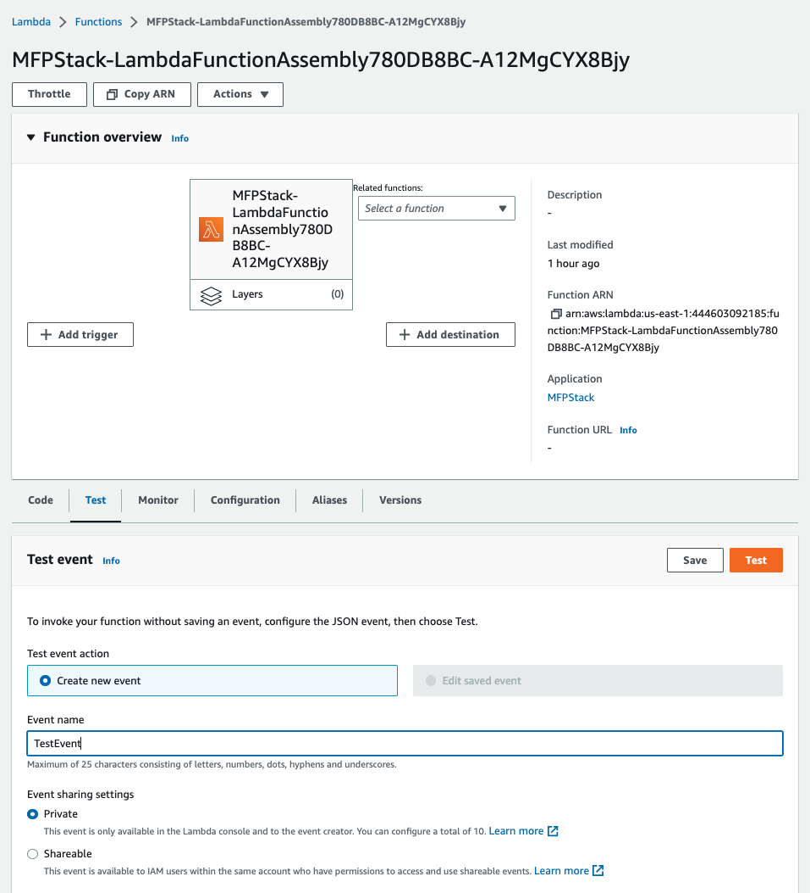
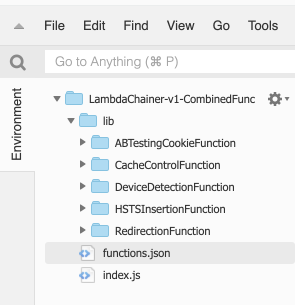

# Multi-function packager tool - Amazon CloudFront

This tool allows you to package multiple Edge Functions - Lambda@Edge or CloudFront Functions into a single function with minimal code changes.

## Pre-requisites:

1. Install [CDK](https://docs.aws.amazon.com/cdk/v2/guide/getting_started.html).
1. Install [NPM](https://docs.npmjs.com/downloading-and-installing-node-js-and-npm).
1. You must have the Lambda@Edge (Node.js runtimes only supported) and CloudFront Functions defined in your AWS account.

## Steps to build

1. Clone and deploy the CDK solution in AWS N.Virginia region (us-east-1)
```
git clone https://github.com/aws-samples/amazon-cloudfront-multi-function-packager.git 
cd amazon-cloudfront-multi-function-package 
npm audit fix 
cdk bootstrap 
cdk deploy
```
1. The stack creates an S3 bucket to hold assembled code artifacts and three Lambda Functions explained below.
*{StackName}-LambdaFunctionPackager{UniqueID}* which is the main Lambda Multi-function packager

## Usage

### Procedure to chain Lambda@Edge functions:

1.	To combine Lambda@Edge functions, navigate to *{StackName}-LambdaFunctionAssembly* function on the [AWS Lambda console](https://console.aws.amazon.com/lambda/home?region=us-east-1#/functions) in *us-east-1*.

2.	 We will use the ‘Test’ feature of AWS Lambda service to build our combined function artifacts. Switch to the ‘Test’ tab to ‘Create new event’, give it a name.



For ‘Event JSON’ use below JSON structure to combine Lambda@Edge Functions using their ARNs.
```
{
"viewer-request":[
    {
    "function_arn":"Lambda Function ARN1:Version1"
    },
    {
    "function_arn":"Lambda Function ARN2:Version2"
    }
 ]
}
```
Example to combine Lambda@Edge functions and attach to more than one event trigger.
```
{
"origin-request":[
    {
        "function_arn":"arn:aws:lambda:us-east-1:123456789012:function:RedirectionFunction:1"
    },
    {
        "function_arn":"arn:aws:lambda:us-east-1:123456789012:function:ABTestingCookieFunction:1"
    },
    {
        "function_arn":"arn:aws:lambda:us-east-1:123456789012:function:DeviceDetectionFunction:1"
    }
    
 ],
"origin-response":[
    {
        "function_arn":"arn:aws:lambda:us-east-1:123456789012:function:CacheControlFunction:$LATEST"
    },
    {
        "function_arn":"arn:aws:lambda:us-east-1:123456789012:function:HSTSInsertionFunction:2"
    }
 ]
}
```
Note: change Lambda Function ARNs to match your environment.

3. *Save changes* to the event and select *Test* in the Lambda console to generate the Combined Function and Role.

4. Check the Lambda console for the newly created combined Lambda@Edge Function. Study the code structure


The ‘*lib*’ folder contains the individual L@E function code and its dependencies.

The ‘*functions.json*’ would contain the mapping between Lambda@Edge event triggers and functions to invoke based for an event type.

```
{
    "origin-request": [
        {
            "function_name": "ABTestingCookieFunction",
            "handler": "index.handler"
        },
        {
            "function_name": "DeviceDetectionFunction",
            "handler": "index.handler"
        },
        {
            "function_name": "RedirectionFunction",
            "handler": "index.handler"
        }
    ],
    "origin-response": [
        {
            "function_name": "CacheControlFunction",
            "handler": "entrypoint.hook"
        },
        {
            "function_name": "HSTSInsertionFunction",
            "handler": "entrypoint.hook"
        }
    ]
}
```
Note: The Multi-function packager framework itself is agnostic to event triggers and invokes only relevant functions for the event type currently being triggered. For example, in above functions.json if a origin-request event is being triggered, then ‘ABTestingCookieFunction’,‘DeviceDetectionFunction’ and ‘RedirectionFunction’ functions are invoked.

The ‘*index.js*’ the main multi-function packager function which orchestrates these calls by first reading the functions.json file, loading the modules and executing the relevant functions. This function itself is agnostic to a particular event type and can handle all 4 event triggers: viewer-request, viewer-response, origin-request & origin-response

#### Things happening as part of the assembly process for Lambda@Edge functions:

1.	Runtimes of individual functions are checked to be same and if they don’t match then execution stops. For example, the build will fail if two functions with runtimes Node12.x and Node14.x are being combined. 
2.	Timeout is computed by summing the individual timeouts of the functions. It is further capped depending on the maximum allowed timeout allowed for an event type. For example, while combining two functions with 3 sec each for a viewer request trigger, though the summation yields 6 seconds it would be set at 5sec (maximum timeout for viewer event triggers)
3.	Memory is set to the maximum memory across the individual functions. For example, for two functions with memory allocated as 128 MB and 256 MB for an origin facing event, the memory for the combined function is set at 256 MB.
4.	If you are combining multiple events types in viewer type or origin type or using both viewer and origin types together, then the maximum memory allowed is capped accordingly. For example, if we combine viewer side and origin side functions having memory 128 MB and 256 MB, then the combined function will be set at 128 MB so it can work across these triggers.
5.	The IAM policies of the individual functions are combined into a new role which is assigned to the generated function.
6.	The handler names of individual functions are auto inferred which are the entry point for invoking the individual functions. This can be viewed in the ‘handler’ field in functions.json file.
7.	S3 bucket provided during deployment holds the combined function zip files under the prefix ‘assembly_function/’

### Procedure to chain CloudFront Functions:

1. To combine CloudFront Functions, navigate to *{StackName}-CloudFrontFunctionAssembly* function on the [AWS Lambda console](https://us-east-1.console.aws.amazon.com/lambda/home?region=us-east-1#/functions) in us-east-1.

2. Switch to the ‘Test’ tab to create a test event.


Define a ‘*New Event*’ with following JSON structure to combine CloudFront Functions using the function name and their deployment stage.

```
{
  "viewer-request": [
    {
      "function_name": "Function Name",
      "stage": "DEVELOPMENT || LIVE"
    },
    {
      "function_name": "CanaryFunction",
      "stage": "DEVELOPMENT || LIVE"
    },
    {
        "function_name":"AddIndexHtml",
        "stage":"DEVELOPMENT || LIVE"
    }
  ]
}

```

Example to combine CloudFront functions and attach to single event trigger.
```
{
  "viewer-request": [
    {
      "function_name": "TrueClientIP",
      "stage": "DEVELOPMENT"
    },
    {
      "function_name": "CanaryFunction",
      "stage": "LIVE"
    },
    {
        "function_name":"AddIndexHtml",
        "stage":"DEVELOPMENT"
    }
  ]
}
```

Note: Change Function name and stage to match your environment

*Save changes* to the event.

3. Select Test in the CloudFront functions console to generate the new Combined CloudFront Function.

4. Check the CloudFront Functions console for the newly created combined Function. Study the code structure.

5. Test if it works.

## Security

See [CONTRIBUTING](CONTRIBUTING.md#security-issue-notifications) for more information.

## License

This library is licensed under the MIT-0 License. See the LICENSE file.
